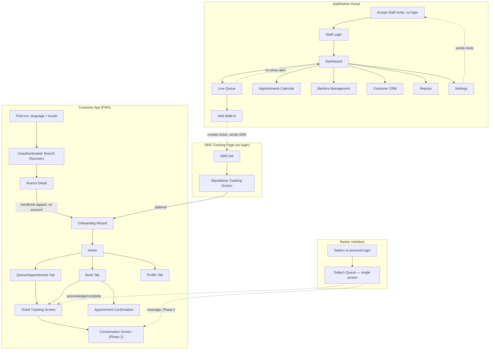

# Pixel Barber — App Flow & Navigation Map

**Document status:** Draft for design and engineering planning
**Version:** 1.0
**Date:** 9 September 2026
**Companion to:** `pixel-barber-prd.md` (business rules, data model, and feature scope live there — this document does not repeat them, only references them where a screen depends on one)

---

## 0. Purpose and Scope

The PRD defines *what* Pixel Barber does. This document defines *where every screen lives, how someone gets from one to the next, and what each screen shows when things go right, when there's nothing to show, and when something fails.* It covers all four surfaces a real person actually touches: the customer progressive web app, the separate staff/admin portal, the barber's own interface, and the no-login SMS tracking page a walk-in customer without an account receives.

Anything stated once here — a pattern, a screen, a rule — is referenced everywhere else it applies, not restated. Section 3 in particular defines conventions (empty states, error handling, loading, language, drafts, deep links) exactly once; every screen list after it just says "per section 3" rather than re-describing the same banner or button five times.

---

## 1. The Four Surfaces at a Glance

| Surface | Who uses it | Platform | Navigation shape |
|---|---|---|---|
| Customer app | Any customer, browsing or with an account | Progressive web app (mobile browser, installable) | Persistent bottom tab bar: Home, Queue, Book, Profile |
| Staff/admin portal | Receptionist, Branch Manager, Owner, Analyst | Separate web portal, desktop/tablet-first | Persistent left sidebar |
| Barber interface | Barbers only | Same web login, on either a personal phone or a shared station tablet | Single working screen, effectively no navigation — see section 9 |
| SMS tracking page | A walk-in customer with no account | Public web link, no login, no nav chrome | One screen, no navigation |

These are four distinct experiences with four distinct shells. A customer never sees the sidebar; a barber never sees the tab bar; nobody but a barber sees the single-screen station view.

---

## 2. Top-Level Sitemap

---

## 3. Global Patterns (Defined Once)

**Empty states.** Every screen that can have nothing to show — no active ticket, no upcoming appointments, no visit history, no feedback yet, no barbers configured, no reports data yet — follows one pattern: a short, plain-language message stating what's missing, plus one primary button that does the obvious next thing ("Join a queue," "Book now," "Add a barber"). No illustrations, no secondary suggestions competing for attention — functional and fast.

**Error and offline handling.** If connectivity drops on any surface, the interface shows a clear, persistent banner ("You're offline — reconnecting…") and freezes all live data exactly where it was — queue positions, wait estimates, and dashboard metrics stop updating rather than silently going stale while looking current. No action that requires the server (joining, cancelling, acknowledging, messaging) is accepted while offline; those controls disable and re-enable the moment the banner clears. A request that fails outright (not just offline, but a real error) shows an inline message at the point of failure with a retry action, never a silent failure.

**Loading.** Lists (queue, appointments, customers, reports) show skeleton placeholders matching their eventual layout. Single actions (join, cancel, acknowledge, submit) show an inline spinner on the button itself, which disables for the duration to prevent a duplicate tap from creating a duplicate action (per the PRD's idempotency requirement).

**Language.** Five languages are supported at launch: English, French, Chinese, Spanish, and German. On first run, the app detects the device/browser locale and pre-selects the closest match, defaulting to English if none match, and shows a lightweight, non-blocking language confirmation as part of the first-run screen (section 4.1) — a customer can proceed immediately without changing anything. The language can be changed at any time from Profile → Settings, and the choice applies immediately across every screen without a restart. The staff/admin portal and barber interface follow the same switcher pattern in their own Settings.

**Draft persistence.** If a customer starts the Book flow (branch, service, barber, and/or date/time selected) and leaves without completing it — closing the app, switching tabs, or losing connectivity — that partial selection is remembered and pre-filled the next time they open the Book tab, up until they either complete or explicitly clear it. Only one draft is kept at a time.

**Deep links and notification taps.** Tapping a push notification opens the app directly to the Ticket Tracking Screen for the relevant ticket (or the Appointment Detail screen, for an appointment reminder) rather than to Home — the customer shouldn't have to navigate to the thing the notification was already about. The SMS link sent to a staff-registered walk-in (PRD section 13) opens the standalone SMS Tracking Page (section 6) directly, with no login. If that same customer later creates a full account, the link's ticket is associated with their new account automatically by matching phone number.

**Session handling.** If a session expires or a customer is logged out unexpectedly mid-flow, they're returned to a login screen with a one-line explanation ("Your session ended — log back in to continue") and, on success, returned to exactly the screen they were on rather than dumped back to Home.

**Real-time sync.** Every screen showing live data (queue position, dashboard metrics, barber status) updates via the same real-time channel described in the PRD's technology section — this document doesn't repeat that architecture, only notes that "live" on any screen below means it updates without a manual refresh.

---

## 4. Customer App — Screens Before Account Creation

Per the decision to let customers browse before committing to an account, these screens are fully usable with no login.

| Screen | Purpose | Key content | Navigates to |
|---|---|---|---|
| 4.1 First-Run (language + locale) | One-time, shown only on very first open | Detected language pre-selected, confirm or change; brief one-line explanation of what Pixel Barber does | Branch Discovery |
| 4.2 Branch Discovery (unauthenticated Home) | Browse branches before choosing one | List/map toggle of all branches; each row shows distance (if location granted), open/closed status, live wait time, starting price; search bar | Branch Detail |
| 4.3 Branch Detail (unauthenticated) | Full picture of one branch before committing | Hours, address/map, contact info, full service list with prices, current queue count and estimated wait, barber list (read-only) | "Join Queue" / "Book Appointment" buttons trigger Onboarding (5) if no account exists, or the Book flow (7) if already logged in |
| 4.4 Login | Returning customer | Phone + password; "Forgot password" link | OTP-based password reset flow → Home (10) |

An unauthenticated customer who taps "Join Queue" or "Book Appointment" from Branch Detail is not shown a separate gate screen — the Onboarding Wizard opens directly, with that branch already remembered so they land back on their original selection once onboarding completes.

---

## 5. Onboarding Wizard

Triggered the first time a customer attempts to join a queue or book an appointment. One guided sequence, one step per screen, back button available at every step except the first.

| Step | Screen | Content | Notes |
|---|---|---|---|
| 1 | Name & Phone | Name, 10-digit Ghana phone number | Phone validated and normalized to +233 in the background |
| 2 | OTP Verification | 6-digit code sent by SMS, resend option after a short cooldown | Failed/expired code shows an inline error with a retry, per section 3 |
| 3 | Set Password | Password + confirmation | Standard strength guidance shown inline |
| 4 | Choose Avatar | Grid of predefined avatars (Phase 2: a build-your-own picker with interchangeable parts and colors, replacing the fixed grid — see PRD section 18's Phase 2 enhancement) | This becomes the customer's marker on every queue view |
| 5 | Notification Preferences | Confirm push permission (native browser prompt) and SMS as backup; default 10-/5-minute lead times shown and editable | Both channels can be left on — this isn't an either/or choice |
| 6 | Welcome / Resume | One-line confirmation | Returns the customer directly into whatever they were doing — their original branch/service selection if they came from Branch Detail, or Home otherwise |

---

## 6. SMS Tracking Page (No Login)

A single standalone screen, no tab bar, no menu — reached only via the SMS link sent when staff register a walk-in (PRD section 13). Shows the ticket number, live position, assigned barber, estimated wait, and a generic (non-customized) avatar, since no account exists yet. A Cancel action is available with the same reason options as the full app. A single, low-pressure banner offers "Save this and track future visits faster — create an account," which opens the Onboarding Wizard (section 5) with the phone number pre-filled from the ticket, so completing it links the existing ticket to the new account rather than treating it as unrelated.

---

## 7. Customer App — Authenticated Experience

### 7.1 Navigation Shell

A persistent bottom tab bar: **Home**, **Queue**, **Book**, **Profile**. A branch-switcher pill sits in the header on every tab once a customer has an active branch (set the first time they pick one, per the persistent-branch-context decision) — tapping it opens the Branch Switcher sheet (7.2) from anywhere, without leaving the current tab.

### 7.2 Branch Switcher (Sheet, Reachable From Any Tab)

Lists every branch with live wait time and distance, current branch marked. Selecting a different branch updates the header pill everywhere immediately; it does not affect an already-active ticket at the previous branch — that stays trackable from the Queue tab regardless of which branch is currently "active" for new bookings.

### 7.3 Home Tab

If the customer has an active ticket or a same-day appointment, Home leads with a live status card (position, barber, wait, one-tap "Track" into the full Ticket Tracking Screen) rather than making them dig for it. Below that: a quick-rebook shortcut (last barber/service/branch), and live wait-time glances at one or two other nearby branches. With nothing active, Home follows the empty-state pattern (section 3): a short message and a single "Join a queue" / "Book now" button.

### 7.4 Queue Tab

Two sections, each independently following the empty-state pattern if there's nothing in it: **Now** (the active ticket, if any, as a live card identical to Home's) and **Upcoming** (future booked appointments, listed by date). Tapping an active ticket opens the Ticket Tracking Screen (7.6); tapping an upcoming appointment opens the Appointment Detail screen (7.8).

### 7.5 Book Tab

One flow, one toggle near the top switching between **Join Now** and **Schedule**. Both paths share the first three steps:

1. **Branch** — defaults to the active branch; changeable inline without leaving the flow.
2. **Service** — price and duration shown per option.
3. **Barber** — a specific barber (with their personal wait estimate) or "Any available" (with the pooled estimate) — both estimates shown side by side so the trade-off is visible before choosing, per the PRD's wait-time model.

The paths diverge at step 4: **Join Now** goes straight to a Review & Confirm screen and, on confirmation, creates the ticket and opens the Ticket Tracking Screen (7.6). **Schedule** adds a Date & Time step (calendar plus available time slots for the chosen branch/barber/service) before its own Review & Confirm, and on confirmation opens an Appointment Confirmation screen and returns the customer to the Upcoming section of the Queue tab. Leaving this flow at any incomplete step triggers draft persistence (section 3).

### 7.6 Ticket Tracking Screen

The core live screen — reached from Home, the Queue tab, a push notification tap, or (in its no-login form) the SMS link. Shows the customer's avatar animating along the queue line, current position, number of customers ahead, assigned barber and what that barber is currently doing, a live wait estimate, and — when location sharing is on — travel/"leave now" guidance. Cancel and "Step Out" actions are always available while waiting. The screen changes state without navigation as the ticket's lifecycle advances: an "Almost your turn" state as it nears the front, a full "You're being served" state once the barber acknowledges (no more countdown, just a confirmation), and — if it comes to that — a plain "Your ticket was released" state with reason and an immediate one-tap rejoin, matching the no-show flow in the PRD. The avatar animating along the line is always a visualization of the position and status already shown in text on the same screen, never the other way around — see the PRD section 18 rule this screen is built to honor.

Once a barber is assigned, a Phase 2 build also surfaces a "Message [Barber name]" entry point on this screen, opening the Conversation Screen (section 7.12).

### 7.7 Cancellation Reason Sheet

A modal invoked from either the Ticket Tracking Screen or Appointment Detail's Cancel action: a short list of reasons (wait too long, can't make it, changed plans, found another barber, emergency, other) and a confirm button. Confirming returns the customer to wherever they cancelled from, now in its empty or "rejoin" state.

### 7.8 Appointment Detail

Reached from the Queue tab's Upcoming section: date, time, branch, barber, service, and price, with Reschedule (re-enters the Schedule half of the Book flow, pre-filled) and Cancel (opens 7.7) actions.

### 7.9 Profile Tab

Account info (name, phone, email if set), avatar (tap to change, reopens the avatar grid from onboarding), password/security (Phase 2: including the fingerprint/face sign-in toggle, section 7.13), notification preferences, language switcher (section 3), default branch, a Visit History list, a Feedback History list, help/support, and logout. Visit History and Feedback History both follow the empty-state pattern for a brand-new account.

### 7.10 Visit History Detail

One past visit: branch, barber, service, price, date, and a link into that visit's feedback (submitted or, if the window hasn't closed, still open to submit).

### 7.11 Feedback Screen

Reached from a post-service prompt (push/SMS/in-app) or from Visit History. Rating scales (overall, service quality, barber, waiting experience, cleanliness, value), an optional free-text field, and a submit action that leads to a brief thank-you state rather than closing abruptly.

### 7.12 Conversation Screen (Phase 2)

Reached from the Ticket Tracking Screen's "Message" entry point once a barber is assigned (PRD section 45.1), or from a message-notification tap (a new case for the deep-link pattern in section 3). A standard chat thread: text bubbles and voice-note bubbles (tap to play, with a duration label) in a single timeline, a timestamp on each, a delivered/read indicator on the customer's own sent messages, and a row of the four quick-reply chips above the composer ("I have arrived," "I am on my way," "I will be approximately 5 minutes late," "Are you ready for me?") that send on a single tap. The composer itself offers a text field and a press-and-hold voice-note record button, capped at 60 seconds with a visible countdown as the cap approaches. Once the ticket or appointment behind this conversation completes, cancels, or expires, the screen switches to a read-only state — the composer and quick-reply row disappear, replaced by a one-line notice ("This conversation ended when your visit did") — per the PRD's messaging lifecycle rule (section 45.4).

### 7.13 Passkey / Fingerprint Setup (Phase 2)

Reached from Profile → password/security (7.9), and also offered as a one-time dismissible prompt the first time a customer signs in with their password on a new device ("Use your fingerprint or face to sign in faster next time?" — PRD section 47.2). Shows a single toggle per device this account is enrolled on ("This iPhone," "This device," named generically since the browser doesn't expose a friendlier device name) with an Enable/Remove action per row — enabling runs the device's native biometric prompt immediately as part of the same tap, never as a separate confirmation step. Declining the initial prompt or a failed biometric attempt returns to the password field with no error state and no repeated nagging on the next login. This screen never shows or asks for a fingerprint image or any biometric data itself — only the enrolled-device list.

---

## 8. Staff/Admin Portal

### 8.1 Navigation Shell

A separate portal from the customer app, with a persistent left sidebar rather than a tab bar, since it's used at a desk or on a mounted tablet rather than one-handed. Sidebar sections, visible per the RBAC capabilities defined in the PRD (a Receptionist simply doesn't see Reports or Settings, rather than seeing them disabled): **Dashboard**, **Live Queue**, **Appointments**, **Barbers**, **Customers**, **Reports**, **Settings**. A branch switcher sits in the header for any role with access to more than one branch; the Owner's switcher includes an "All Branches" option that leads to the business-wide dashboard (8.4) instead of a single branch's. The header also carries a personal account menu (name/initials, distinct from the Owner-only Staff & Roles area in Settings) with **My Account** — password/security, including the Phase 2 fingerprint/face sign-in toggle for that device (PRD section 47.3) — and **Log Out**; every staff member manages their own passkey enrollment here, regardless of role, since it's a personal device convenience rather than an administrative setting.

### 8.2 Staff Login

Phone/email plus password — a separate credential set from customer accounts, since a staff member is never also a customer account in this model. A staff member always sets that password for the first time through Accept Staff Invite (8.15), not on this screen — there is no "create account" option here, only "forgot password," because every staff account originates from an invite (PRD section 46). Phase 2: on a device that's completed the passkey enrollment in My Account (8.1), a "Use fingerprint / Face ID" option appears beside the password field as a faster path in — declining it or a failed attempt falls back to the password field exactly as before (PRD section 47.3).

### 8.3 Dashboard (Single Branch)

Live metric cards (waiting, in service, average wait, no-shows today, appointments vs. walk-ins), a queue-health alert banner once average wait crosses the configured threshold, and quick links into Live Queue and Appointments. This is the landing screen after login for any single-branch role.

### 8.4 Business-Wide Dashboard (Owner)

The same metric shapes as 8.3, shown per branch side by side for comparison, each card linking through to that branch's own Dashboard for a closer look.

### 8.5 Live Queue

The working screen for day-to-day queue management: a live table of every ticket (position, customer, service, assigned barber, wait time, status) with inline actions to reassign a barber, cancel a ticket, or mark someone arrived, plus a persistent "+ Add Walk-in" button. A ticket that enters its no-show grace period surfaces here as a highlighted row with a direct alert, rather than requiring staff to notice it on their own (see the cross-surface no-show journey in section 10). A Barber Board section on the same screen shows each barber's status card — current customer, time in service, next up, workload — with a quick status toggle (Available / Break / Offline).

### 8.6 Add Walk-in (Modal)

A slide-over, not a full page switch, so a receptionist never loses their place in the Live Queue underneath it: name, phone (optional), service, barber preference (optional). Submitting creates the ticket, closes the modal, and the new ticket appears in the Live Queue list immediately.

### 8.7 Appointments Calendar

Day/week view of scheduled appointments for the active branch (or filtered by barber), with the ability to create an appointment on a customer's behalf and click through to Appointment Detail.

### 8.8 Appointment Detail (Staff View)

Same information as the customer's own Appointment Detail (7.8), plus staff actions: reschedule, cancel, mark no-show, or check in manually.

### 8.9 Barbers Management

A list of barbers at the active branch (or, for the Owner, filterable across branches), with add/edit access to a Barber Detail screen: profile fields, the skill/service matrix, schedule, branch assignment (including a floating assignment for a given day), and status.

### 8.10 Customers (CRM)

A searchable, filterable customer table: name, phone, last visit, no-show count, average rating. Selecting one opens Customer Detail: full visit and feedback history, the informational reliability flag from the PRD's no-show handling (never presented as a warning label, just a data point), and a Message Customer action.

### 8.11 Message Customer / Broadcast

Message Customer opens a simple compose box scoped to one person. Broadcast (Owner/Manager only) composes to a segment (e.g., everyone with a visit in the last 30 days) with the segment criteria shown plainly before sending, and a separate confirmation step given how many people a broadcast reaches.

### 8.12 Settings

Three areas, not all reachable by the same role: **Services & Pricing** (catalog, branch overrides, active/inactive toggles) and **Branch Settings** (hours, special closures, profile info, the geofence radius used for arrival detection) are available to an Owner or Branch Manager, per their existing scope. **Staff & Roles** is Owner-only, per the `manage_staff` capability (PRD section 32/46) — a Branch Manager does not see this area at all, the same way a Receptionist doesn't see Reports or Settings' other areas. It shows an accounts table (name, role, branch, status — Active or Invite Pending) plus a "+ Invite Staff" action that opens a short form (name, role, branch, phone or email) and sends the invite described in 8.15. A row still in Invite Pending state offers **Resend** and **Revoke** instead of the usual edit actions, since there's no active account yet to edit. An **Audit Log** viewer sits alongside these for Owner/Manager, searchable by action, user, and date.

### 8.13 Reports

Filterable by branch and date range, covering the metrics defined in the PRD's reporting section, with export.

### 8.14 Conversation Viewer (Phase 2)

Reached from a ticket row in Live Queue (8.5) or from Customer Detail (8.10) once a conversation exists for that ticket. By default shows metadata only — started, message count, last activity, delivered/read state — per PRD section 45.5's default access level. A "View messages" action is available only to a Branch Manager or Owner (the `view_message_content` capability, PRD section 32); using it requires entering a short reason before the thread becomes visible, and that access is written to the Audit Log (8.12) automatically. A read-only badge appears once the underlying ticket has completed, cancelled, or expired, matching the customer's own Conversation Screen state.

### 8.15 Accept Staff Invite (No Login)

Reached only by opening the invite link sent from Staff & Roles (8.12) — there is no way to browse to this screen, and it doesn't appear in the sidebar or navigation shell described in 8.1, matching the pattern the SMS Tracking Page (section 6) already uses for a link-only, no-nav screen. It shows the invitee's name and assigned role/branch as a plain confirmation ("You've been invited to join Pixel Barber as a Barber at Osu Branch") so the person can see the invite is genuinely meant for them, plus a single set-password field with confirmation. Submitting activates the account immediately and signs the person straight into the Staff/Admin Portal at its normal Dashboard (8.3) — there's no separate "invite accepted, now log in" round-trip. An invite link that's expired, already used, or revoked shows a plain explanation instead of the form ("This invite is no longer valid — ask your Owner to send a new one"), per the error-handling convention in section 3, rather than a generic broken-link error.

---

## 9. Barber Interface

Deliberately not a multi-screen app — a barber mid-haircut needs one screen with large, unambiguous actions, not a menu to navigate.

| Screen | Purpose | Content / actions |
|---|---|---|
| 9.1 Login | Personal phone: standard staff login (8.2), first accessed via Accept Staff Invite (8.15) like any other staff role, including the Phase 2 fingerprint/Face ID option once enrolled. Shared station tablet: a quick PIN-based login at the start of a shift, since multiple barbers share the same device across a day; the PIN itself is set up separately, by an Owner or Branch Manager in Barbers Management (8.9), after the barber's account already exists. Phase 2, stations with fingerprint hardware only: a barber who has enrolled their fingerprint on that specific station (a one-time setup step from that station, done after signing in by PIN — PRD section 47.4) can touch the sensor instead of entering their PIN; any station without the hardware, or before a barber enrolls, uses the PIN exactly as before | Phone/email + password or fingerprint/Face ID (personal device) or staff PIN, optionally alongside an enrolled fingerprint (shared station) |
| 9.2 Today's Queue (the single working screen) | Everything a barber needs mid-shift | Current customer card with a "Mark Complete" action; Next Customer card with "Acknowledge" and "Not Present" actions; a count of how many remain in their queue; a status toggle (Available / Break / End Shift). Phase 2 adds a small "Message" icon on the current and next customer cards, opening that customer's Conversation Screen (7.12) without leaving this single working screen |
| 9.3 Not-Present Confirmation | Lightweight modal when "Not Present" is tapped | Confirms the action, explains the grace-period countdown just started and is now visible to admin (PRD section 21) |
| 9.4 End of Shift | Personal phone: simple logout. Shared station: an explicit "End Shift" action that clears the session so the next barber's PIN login starts clean | Prevents one barber's queue view lingering on a device the next barber picks up |

---

## 10. Cross-Surface Journeys

Some journeys only make sense traced across more than one surface — these are the ones the PRD's own journey list (its section 44) implies but doesn't walk screen-by-screen:

**Staff-registered walk-in, start to finish.** Receptionist opens Add Walk-in (8.6) on the Live Queue → ticket created and appears in Live Queue (8.5) and on the relevant Barber's Today's Queue (9.2) → customer receives the SMS link → customer opens the standalone SMS Tracking Page (6) with no login → if the customer later creates an account, that ticket links to it automatically by phone number match.

**No-show escalation.** Barber taps "Not Present" (9.3) → ticket highlighted in Live Queue (8.5) with an alert and contact details → receptionist messages or calls from Customer Detail (8.10) or directly from the alert → if the customer responds in time, the ticket returns to Called/Confirmed on both the Barber's screen (9.2) and the customer's Ticket Tracking Screen (7.6); if the grace period lapses, the ticket cancels, the customer's Tracking Screen shows the "released" state with a rejoin button, and the next eligible ticket is called.

**Shared-station shift changeover.** Barber A ends their shift (9.4), clearing the station → Barber B logs in with their PIN (9.1) → Barber B's own Today's Queue loads, showing only their assigned tickets, never Barber A's leftover view.

**Owner drilling into one branch.** Business-Wide Dashboard (8.4) → click a branch's card → that branch's own Dashboard (8.3), with the header's branch switcher now reflecting the drilled-into branch until changed back.

**Language switch mid-session.** Changed in Profile (customer) or Settings (staff/barber) → applies immediately across every currently open screen without a reload, including the tab bar/sidebar labels themselves.

**Notification tap.** A push notification for "you're up" opens directly to the Ticket Tracking Screen (7.6); an appointment reminder opens directly to Appointment Detail (7.8) — never to Home first.

**Customer messages the assigned barber (Phase 2).** Barber assigned on a ticket or appointment (8.5/8.7) → "Message" entry point appears on Ticket Tracking (7.6) → customer opens the Conversation Screen (7.12) and sends a text, a voice note, or a quick reply → barber sees it on Today's Queue (9.2) and replies → ticket completes, cancels, or expires → both sides' Conversation Screens switch to read-only at the same moment, and the thread remains visible to both until it's anonymized 30 days later (PRD section 45.4).

---

## 11. Empty States Reference

| Screen | Empty condition | What shows |
|---|---|---|
| Home (7.3) | No active ticket, no same-day appointment | Message + "Join a queue" / "Book now" |
| Queue tab — Now (7.4) | No active ticket | Message + "Join a queue" |
| Queue tab — Upcoming (7.4) | No booked appointments | Message + "Book an appointment" |
| Visit History (7.9) | Brand-new account, no completed visits | Message only, no button (nothing to do yet) |
| Feedback History (7.9) | No feedback submitted yet | Message only |
| Branch Discovery (4.2) | No branches match a search/filter | Message + "Clear filters" |
| Live Queue (8.5) | Nobody currently waiting at this branch | Message + "+ Add Walk-in" |
| Appointments Calendar (8.7) | No appointments on the selected day | Message + "New appointment" |
| Barbers Management (8.9) | New branch, no barbers added yet | Message + "Add a barber" |
| Customers/CRM (8.10) | New branch, no customer history yet | Message only |
| Reports (8.13) | Not enough data yet for the selected range | Message explaining why, no misleading zeroed chart |
| Conversation Screen (7.12), Phase 2 | No barber assigned yet | Message only — the "Message" entry point simply doesn't appear on Ticket Tracking until a barber is assigned |

---

## 12. Error and Exception States Reference

| Scenario | Surface | Behavior |
|---|---|---|
| Network drops mid-session | Any | Persistent offline banner, live data frozen in place (section 3) |
| OTP code wrong or expired | Onboarding (5.2), password reset | Inline error, resend option after cooldown |
| Attempt to join a queue that just closed / branch just closed | Book flow (7.5) | Inline message at the confirm step, returned to branch selection |
| Duplicate join attempt (double tap) | Book flow, Live Queue | Second attempt is a no-op; only one ticket exists, per the PRD's idempotency requirement |
| Two staff edit the same ticket at once | Live Queue (8.5) | Second actor's action is rejected with the current state shown, not silently overwritten |
| Session expires mid-flow | Any authenticated surface | Returned to login with a one-line explanation, then back to the exact prior screen on success (section 3) |
| GPS/location denied or unavailable | Ticket Tracking (7.6) | Travel guidance simply doesn't appear; fixed-time notifications and the manual arrival toggle still work |
| SMS fails to deliver | Add Walk-in (8.6), any SMS notification | Delivery failure flagged to staff on that ticket; retry or alternate contact suggested |
| Push notification not confirmed delivered for a critical message | Any | Falls back to SMS automatically (per PRD section 20) |
| Barber's device loses connection mid-acknowledgment | Today's Queue (9.2) | Action shown as pending/retrying rather than silently failing; barber sees a clear "not yet confirmed" state before it succeeds |
| Voice note fails to upload (Phase 2) | Conversation Screen (7.12) | The recorded note stays in the composer with a retry action rather than being silently dropped; it's only cleared once the send actually succeeds |
| Message send attempted on a read-only conversation (Phase 2) | Conversation Screen (7.12) | Composer and quick-reply row are already hidden once read-only (section 7.12); this is a server-side rejection as a backstop, not a state a user should normally be able to reach |

---

## 13. Open Questions for Design

A few things are easiest to resolve once actual screens are being designed rather than guessed at here: the exact visual treatment of the queue animation on the Ticket Tracking Screen (section 7.6); whether the Branch Switcher (7.2) should also surface on the Book tab's branch step or only in the header; how many nearby-branch wait times to surface on Home (7.3) before it feels cluttered; and whether the Barber Board (8.5) belongs on the main Live Queue screen or as its own sidebar section once a branch has enough barbers to make the combined view crowded.
